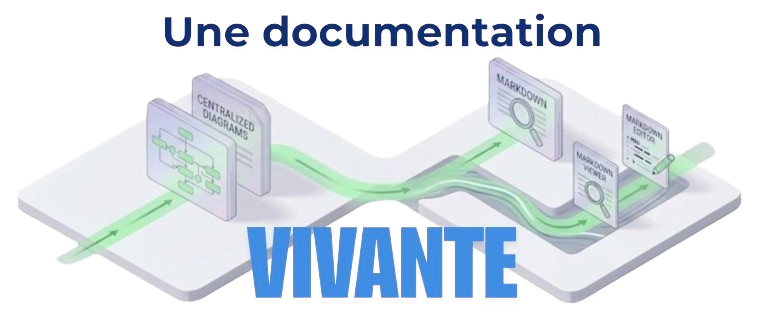

# Living Documentation

[🇬🇧 Read in English](./README.md)

> **Hub local de documentation Markdown avec serveur MCP intégré — vos agents de code créent les ADR, dessinent les diagrammes et détectent la dérive pendant que vous codez.**

Du Markdown sur disque, pas de cloud, pas de base de données, pas d'étape de build. Pointez l'outil vers un dossier, ouvrez `http://localhost:4321`. Branchez n'importe quel agent IA compatible MCP (Claude Code, Claude Desktop, Cursor…) et votre documentation se maintient à mesure que le code évolue.

    

```bash
npx living-documentation                # assistant interactif (EN/FR)
npx living-documentation ./docs         # servir un dossier existant
```



---

## Deux usages

### 1. Avec un agent IA — la fonctionnalité phare

Living Documentation embarque un **serveur MCP** sur `POST /mcp`. N'importe quel agent compatible MCP peut lire, créer et auditer la documentation projet de façon autonome.

| Ce que vous dites…                                          | Ce que l'agent déclenche…          | Ce qui se passe                                                                                                  |
| ----------------------------------------------------------- | ---------------------------------- | ---------------------------------------------------------------------------------------------------------------- |
| *« feature terminée »* / *"feature done"*                   | `create-adr`                       | Cherche les ADR existants, supplante l'ADR obsolète s'il y en a, écrit un nouvel ADR en `To be validated`, relie les fichiers source via les métadonnées. |
| *« audite les ADR »* / *"audit the ADRs"*                   | `audit-adrs-drift`                 | Liste chaque ADR sous 80 % de fiabilité et remet chacun en cohérence — soit re-baseliner les hashes, soit supplanter après confirmation. |
| *« vérifie la pertinence de cet ADR »* / *"review this ADR"* | `review-adr-relevance`             | Revue d'un ADR précis contre les fichiers source liés ; rafraîchit les hashes ou propose la supersession.        |
| *« retrodocumente depuis git »* / *"backfill ADRs from git"* | `retrodocument-adrs-from-git`      | Parcourt l'historique git du plus ancien au plus récent et crée des ADR pour les décisions durables jamais documentées. |
| *« donne-moi la big picture »*                              | `generate-context-diagram`         | Crée un diagramme C4 de contexte **dérivé des documents**, jamais inventé.                                       |

**Tous les nouveaux ADR atterrissent en `To be validated`.** *Vous* les promouvez. L'agent ne promeut jamais à votre place.

### 2. Sans IA, en solo

Un hub doc personnel : ADR, notes de réunion, journal de dev, plans de features, esquisses d'architecture — tout reste en Markdown sur disque, git-friendly, zéro lock-in. Édition inline, snippets, paste d'image, pièces jointes, éditeur de diagrammes, recherche plein-texte, export PDF/HTML/Notion/Confluence.

Les deux modes se mélangent : prendre des notes en solo toute la semaine, puis laisser l'agent enregistrer l'ADR quand la feature est livrée.

---

## Démarrage rapide

```bash
# Assistant interactif — crée un dossier de doc de démarrage (EN ou FR), scaffold
# AGENTS.md / CLAUDE.md / memory/MEMORY.md à la racine du projet et fait des symlinks
# dans <docs>/AI/ pour que les agents IA les trouvent.
npx living-documentation

# Ou servir un dossier existant
npx living-documentation ./docs
npx living-documentation ./docs --port 4000 --open
```

Puis ouvrez [http://localhost:4321](http://localhost:4321) (viewer) et [http://localhost:4321/admin](http://localhost:4321/admin) (config).

> Le chemin du dossier doit être **relatif** (`./docs`, `../shared/docs`…). Les chemins absolus et `~` sont rejetés pour que `.living-doc.json` reste portable et soit committable.

### Installation

```bash
npx living-documentation                 # sans installation
npm install -g living-documentation      # global
```

---

## Connecter votre agent IA

### Claude Code

```bash
claude mcp add --transport http living-documentation http://localhost:4321/mcp
```

Ou manuellement dans `.claude/settings.json` :

```json
{
  "mcpServers": {
    "living-documentation": { "type": "http", "url": "http://localhost:4321/mcp" }
  }
}
```

### Claude Desktop

Dans `~/Library/Application Support/Claude/claude_desktop_config.json` (macOS), puis redémarrer :

```json
{
  "mcpServers": {
    "living-documentation": { "type": "http", "url": "http://localhost:4321/mcp" }
  }
}
```

### Cursor, Continue, tout client MCP

Même endpoint HTTP : `http://localhost:4321/mcp` (transport Streamable HTTP, sans état).

> Le serveur Living Documentation doit tourner (`npx living-documentation ./docs`) avant que l'agent ne s'y connecte.

---

## Concepts centraux

- **Markdown sur disque** — chaque document est un fichier `.md`. La configuration vit dans `.living-doc.json` à côté. Les deux sont git-friendly.
- **Pattern de nom de fichier** — par défaut `YYYY_MM_DD_HH_mm_[Category]_title.md`. Configurable ; date, catégorie et titre sont extraits. Les fichiers hors pattern apparaissent sous **General**.
- **Dossiers → catégories → docs** dans le sidebar. Les noms de dossiers deviennent les libellés ; un préfixe numérique (`1_TUTORIAL`, `2_REFERENCE`) contrôle l'ordre sans s'afficher dans l'UI.
- **Les ADR** sont le journal canonique des décisions. Le serveur MCP impose un frontmatter normalisé (`**date:**`, `**status:**`, `**description:**`, `**tags:**`) et un statut initial `To be validated` que seul un humain promeut.
- **`sourceRoot`** désigne le code du projet. Les tools MCP source (`list_source_files`, `read_source_file`, `search_source`) et l'attache de métadonnées en dépendent. Défaut : parent du dossier de doc.
- **Métadonnées source + jauge de fiabilité** — lier un document à ses fichiers source. Chaque lien stocke un SHA-256. La jauge dans le header (`🔴 → 🟡 → 🟢`) reflète `unchanged / total`. Dès qu'un fichier change ou disparaît, la dérive est visible. Les **god files** (`package.json`, lock files, manifests, barrels) sont exclus par convention.
- **Les diagrammes sont des vues dérivées** — ils citent les documents qui les justifient (`evidence`). Ils ne peuvent pas introduire un concept absent de la documentation.

---

## Référence MCP

### Tools (19)

| Groupe                | Tool                          | Description                                                                                                |
| --------------------- | ----------------------------- | ---------------------------------------------------------------------------------------------------------- |
| Onboarding            | `get_server_guide`            | Retourne le guide du serveur : workflow, conventions, règles des diagrammes.                               |
| Documents             | `list_documents`              | Inventaire : `id`, `title`, `category`, `folder`, `linkHref`.                                              |
|                       | `read_document`               | Contenu Markdown brut d'un document.                                                                       |
|                       | `create_document`             | Crée un nouveau `.md` (nom de fichier dérivé du pattern, paramètre `date` optionnel pour la rétro-doc).    |
|                       | `update_document`             | Écrase un document existant (correction de dérive, supersession).                                          |
| Diagrammes            | `list_diagrams`               | Liste les diagrammes sauvegardés.                                                                          |
|                       | `read_diagram`                | Lit les nœuds + arêtes d'un diagramme.                                                                     |
|                       | `create_diagram`              | Crée / écrase un diagramme (garde-fous serveur : progression C4 et labels d'arêtes).                       |
| Code source (fallback) | `list_source_files`          | Liste les fichiers sous `sourceRoot` (ignore : `node_modules`, `dist`, `.git`…).                           |
|                       | `read_source_file`            | Lit un fichier sous `sourceRoot`.                                                                          |
|                       | `search_source`               | Recherche grep-like sous `sourceRoot`.                                                                     |
| Métadonnées           | `list_metadata`               | Fichiers source liés à un document.                                                                        |
|                       | `get_accuracy`                | Statut par entrée (`unchanged` / `modified` / `missing`) + accuracy pondérée ∈ [0, 1].                     |
|                       | `add_metadata`                | Attache un fichier source (chemin sous `sourceRoot`), enregistre SHA-256. **Saute les god files.**         |
|                       | `remove_metadata`             | Détache un lien (idempotent — pour renames/deletes).                                                       |
|                       | `refresh_metadata`            | Re-hashe chaque lien (re-baseline après une mise à jour).                                                  |
| Audit ADR             | `list_adrs_below_accuracy`    | Jusqu'à 10 ADR dont l'accuracy < 80 %, triés du plus dégradé. Exclut `SuperSeeded` et non-ADR.             |
|                       | `review_adr_relevance`        | Rapport factuel sur un ADR + fichiers en dérive à relire. Retourne un `state` pour piloter le LLM.         |
| Rétrodocumentation    | `retrodocument_adrs_from_git` | Jusqu'à 200 commits git (du plus ancien), classés `candidate` / `trivial` / `merge`, avec flags god-files. Pour backfiller les ADR manquants. |

### Prompts (10)

| Groupe         | Prompt                          | Quand l'invoquer                                                                                       |
| -------------- | ------------------------------- | ------------------------------------------------------------------------------------------------------ |
| Cycle de vie ADR | `create-adr`                  | Une feature vient d'être implémentée ou modifiée. Enregistre la décision, supersede l'ADR antérieur si pertinent. |
|                | `audit-adrs-drift`              | Audit batch : ramener chaque ADR en dérive à un état clair (re-baseline ou supersession confirmée).    |
|                | `review-adr-relevance`          | Revue d'un ADR précis contre ses fichiers source liés.                                                 |
|                | `retrodocument-adrs-from-git`   | Backfill d'ADR depuis l'historique git quand le projet en manque.                                      |
| Diagrammes     | `generate-context-diagram`      | DÉFAUT. Diagramme C4 de contexte, gardé serveur.                                                       |
|                | `generate-container-diagram`    | Sur demande explicite. Diagramme C4 conteneur d'un système.                                            |
|                | `generate-uml-diagram`          | Sur demande explicite. UML classe/séquence/état/activité/cas d'usage.                                  |
|                | `generate-screen-guide`         | Sur demande explicite. Capture annotée avec post-it callouts.                                          |
|                | `update-diagram-from-docs`      | Relit les documents source pour mettre à jour les diagrammes existants.                                |
|                | `flow`, `erd`                   | Diagrammes flow linéaires / entité-relation.                                                           |

Un `GET http://localhost:4321/mcp` retourne les schémas live des tools et prompts pour inspection.

---

## Fonctionnalités d'édition

- **Éditeur inline** — édition de n'importe quel document dans le navigateur, sauvegarde disque instantanée.
- **Panneau Snippets** (`🧩 Snippets`) — constructions Markdown pré-fabriquées au curseur : blocs repliables, liens (in-doc, cross-doc, ancre), listes, blocs de code, blockquotes, séparateurs, images. Plus un **éditeur de tableaux** (grille dynamique → tableau Markdown aligné) et un **éditeur d'arborescence** (indentation → ASCII tree avec `├──` / `└──`). Sélectionner un snippet existant **détecte son type** et pré-remplit le formulaire pour édition.
- **Paste d'image** — colle depuis le presse-papier pendant l'édition, auto-upload vers `<docs>/images/`, insertion en Markdown.
- **Pièces jointes** — glisser, déposer, coller ou choisir n'importe quel fichier non-image (PDF, archive, doc bureautique). Upload sous `<docs>/files/`, insertion en pill trombone. Extensions bloquées et limites configurables en Admin.
- **Recherche plein-texte** — filtre filename instantané + recherche serveur de contenu ; pour chaque fichier liste chaque occurrence, surlignée, navigable.
- **Préfixe de recherche `metadata://<nomdefichier>`** — recherche inverse : quels documents référencent cette pièce jointe ?
- **Annotations** — marqueurs de surlignage persistants par document (jaune / rose / vert / bleu).
- **Navigation par ancre** — `[label](#heading-slug)` scrolle correctement après le rendu async ; IDs auto-générés.
- **Mode sombre** — suit la préférence système, basculable manuellement. Coloration syntaxique toujours sombre.


---

## Éditeur de diagrammes

Éditeur de diagrammes canvas intégré (vis-network), accessible via `/diagram?id=...`.

- **Progression C4 imposée** — contexte d'abord (défaut), conteneur/composant seulement sur demande explicite. UML sur demande explicite.
- **`kind` architectural vs `renderAs` visuel** — sépare le concept (`software_system`, `database`, `queue`, `api`, `cloud_service`…) de la forme (`box`, `ellipse`, `database`, `actor`, `post-it`…). Le MCP choisit des défauts sensés pour chaque `kind`.
- **Provenance documentaire (`evidence`)** — chaque nœud / arête architectural peut citer le document et la section qui le justifient. L'éditeur lève des warnings si l'evidence manque.
- **Bibliothèques de formes personnalisées** sur `/shape-editor` — définissez vos propres formes (icônes SVG, ports, couleurs par défaut) et réutilisez-les.
- **Ports** pour arêtes ancrées, **guides d'alignement**, **undo/redo**, **snap-to-grid**, **paste d'image**, **export PNG**, **deep-link** vers un diagramme par id.

---

## Organisation des fichiers

```
docs/
├── 2024_01_15_09_30_[DevOps]_deploy.md          → catégorie : DevOps
├── 1_tutorial/                                   → dossier : Tutorial (préfixe caché dans l'UI)
│   └── 2024_03_01_10_00_[Onboarding]_setup.md   → dossier : Tutorial / catégorie : Onboarding
├── adrs/
│   └── 2024_04_01_10_15_[Architecture]_event_sourcing.md
└── 2_reference/
    └── api.md                                    → dossier : Reference / catégorie : General
```

- Le tag `[Category]` est extrait du filename quel que soit le dossier.
- Les fichiers sans `[Category]` tombent sous **General**. **General** est toujours rendu en premier.
- Les dossiers sont triés alphabétiquement — préfixer par `1_`, `2_`… pour forcer un ordre ; le préfixe est caché dans l'UI mais visible au survol.
- L'imbrication de sous-dossiers est récursive.


---

## Configuration (`.living-doc.json`)

Créé automatiquement dans votre dossier de doc au premier lancement. Modifiable depuis l'Admin ou à la main.

```json
{
  "filenamePattern": "YYYY_MM_DD_HH_mm_[Category]_title",
  "title": "Living Documentation",
  "theme": "system",
  "port": 4321,
  "extraFiles": ["../README.md", "../CLAUDE.md"],
  "sourceRoot": "../src",
  "blockedFileExtensions": [".exe", ".bin"]
}
```

| Champ                  | Rôle                                                                                                       |
| ---------------------- | ---------------------------------------------------------------------------------------------------------- |
| `filenamePattern`      | Convention de nom de fichier utilisée pour extraire date / catégorie / titre. Le token `[Category]` est obligatoire, exactement une fois. |
| `extraFiles`           | Fichiers Markdown ordonnés **hors** du dossier docs (ex. `README.md`, `CLAUDE.md`). Affichés en premier dans General. |
| `sourceRoot`           | Où vit votre code (relatif au dossier docs). Défaut : `..`. Utilisé par les tools MCP source + métadonnées. |
| `blockedFileExtensions` | Liste de sécurité des extensions de pièces jointes, éditable en Admin.                                    |

**Tous les chemins sont relatifs POSIX** pour que `.living-doc.json` reste portable. Les chemins absolus legacy sont migrés silencieusement à la première lecture.


---

## Export

| Format                   | Endpoint                | Notes                                                              |
| ------------------------ | ----------------------- | ------------------------------------------------------------------ |
| PDF (par doc)            | `POST /api/export/html` | Boîte de dialogue d'impression du navigateur depuis le HTML rendu. |
| HTML — mode Notion       | `POST /api/export/html` | Bundle HTML unique adapté à l'import Notion.                       |
| HTML — mode Confluence   | `POST /api/export/html` | Bundle HTML zippé adapté à l'import Confluence.                    |
| Bundle Markdown          | `POST /api/export/markdown` | Zip de tous les documents avec liens normalisés.               |

---

## Surfaces UI

| URL              | Page                                                                                                    |
| ---------------- | ------------------------------------------------------------------------------------------------------- |
| `/`              | Viewer — sidebar, rendu document, édition inline, snippets, recherche, pièces jointes.                  |
| `/admin`         | Config — titre, thème, pattern de filename, extra files, source root, liste de sécurité fichiers.       |
| `/diagram?id=`   | Éditeur de diagrammes (vis-network) avec conventions C4, ports, guides d'alignement, undo/redo.         |
| `/shape-editor`  | Éditeur de bibliothèques de formes personnalisées — icônes SVG, couleurs par défaut, ports.             |
| `/context`       | Page de contexte IA — instructions, règles, mémoire, **explorateur MCP** (tester les tools en live).    |


---

## API REST

<details>
<summary>API HTTP complète (cliquer pour déplier)</summary>

| Méthode  | Endpoint                       | Description                                                        |
| -------- | ------------------------------ | ------------------------------------------------------------------ |
| `GET`    | `/api/documents`               | Liste les documents avec métadonnées (inclut extra files).         |
| `GET`    | `/api/documents/:id`           | Contenu du document + HTML rendu.                                  |
| `POST`   | `/api/documents`               | Crée depuis `{ title, category, folder?, content?, date? }`.       |
| `PUT`    | `/api/documents/:id`           | Sauvegarde du contenu sur disque.                                  |
| `DELETE` | `/api/documents/:id`           | Supprime un document.                                              |
| `GET`    | `/api/documents/search?q=`     | Recherche plein-texte.                                             |
| `GET`    | `/api/config`                  | Lit la config.                                                     |
| `PUT`    | `/api/config`                  | Met à jour la config (`title`, `theme`, `filenamePattern`, `extraFiles`, `sourceRoot`, `blockedFileExtensions`, …). |
| `GET`    | `/api/browse?path=`            | Liste les dossiers et `.md` à un chemin.                           |
| `POST`   | `/api/browse/mkdir`            | Crée un dossier sous la racine docs.                               |
| `POST`   | `/api/images/upload`           | Upload d'image base64 → `<docs>/images/`.                          |
| `POST`   | `/api/files/upload`            | Upload de pièce jointe base64 → `<docs>/files/`.                   |
| `GET`    | `/api/files`                   | Liste toutes les pièces jointes (chronologique).                   |
| `PUT`    | `/api/files/:filename`         | Remplace une pièce jointe.                                         |
| `DELETE` | `/api/files/:filename`         | Supprime une pièce jointe.                                         |
| `GET`    | `/api/metadata/:docId`         | Rapport de fiabilité d'un doc.                                     |
| `POST`   | `/api/metadata/:docId`         | Ajoute ou remplace un lien.                                        |
| `DELETE` | `/api/metadata/:docId`         | Retire un lien.                                                    |
| `POST`   | `/api/metadata/:docId/refresh` | Re-baseline les hashes.                                            |
| `GET`    | `/api/browse-source?path=`     | Navigue l'arbre source ancré sur `sourceRoot`.                     |
| `GET`    | `/api/diagrams`                | Liste les diagrammes sauvegardés.                                  |
| `GET`    | `/api/diagrams/:id`            | Lit un diagramme (nœuds + arêtes).                                 |
| `PUT`    | `/api/diagrams/:id`            | Crée ou met à jour un diagramme.                                   |
| `DELETE` | `/api/diagrams/:id`            | Supprime un diagramme.                                             |
| `GET`    | `/api/shape-libraries`         | Liste les bibliothèques de formes personnalisées.                  |
| `PUT`    | `/api/shape-libraries/:id`     | Sauvegarde une bibliothèque de formes.                             |
| `GET`    | `/api/annotations[/:docId]`    | Liste les annotations (tous docs / un doc).                        |
| `POST`   | `/api/annotations/:docId`      | Ajoute une annotation.                                             |
| `DELETE` | `/api/annotations/:docId/:id`  | Supprime une annotation.                                           |
| `POST`   | `/api/export/html`             | Export HTML — modes Notion / Confluence.                           |
| `POST`   | `/api/export/markdown`         | Export bundle Markdown.                                            |
| `GET`    | `/api/wordcloud?path=&ext=`    | Concatène récursivement les fichiers source filtrés en texte brut. |
| `POST`   | `/mcp`                         | Endpoint Model Context Protocol (Streamable HTTP).                 |
| `GET`    | `/mcp`                         | Résumé live des schémas tools + prompts.                           |

</details>

---

## Build et test

```bash
git clone https://github.com/craftskillz/living-documentation.git
cd living-documentation
npm install
npm run setup-hooks                      # une fois : active .githooks/ comme core.hooksPath
npm run dev -- ./documentation          # nodemon + ts-node, watch src + bin
npm run build                            # tsc → dist/ + copie des assets frontend
npm run test:e2e                         # Playwright end-to-end (~3 s, ~30 specs MCP)
npm run test:coverage                    # couverture c8 V8-natif
```

Les tests end-to-end utilisent **Playwright**. Chaque test lance un vrai process CLI enfant sur un fixture frais sur un port aléatoire — pas de fuite d'état, parallélisable. Couverture serveur via **c8** (V8 natif, ~72 % global, 83 % sur `src/routes` et `src/lib`).

### Contribuer

Ce dépôt embarque un hook `pre-commit` (dans `.githooks/`) qui impose le contrat bilingue des README : si vous touchez `README.md`, vous devez aussi toucher `README.fr.md`, et inversement. Lancez `npm run setup-hooks` une fois après le clone pour l'activer. Le même check tourne en CI sur chaque PR (`.github/workflows/readme-sync.yml`), donc la règle est imposée même si un contributeur oublie le setup local.

---

## Licence

[AGPL-3.0](./LICENSE) — © Youssef MEDAGHRI-ALAOUI.
