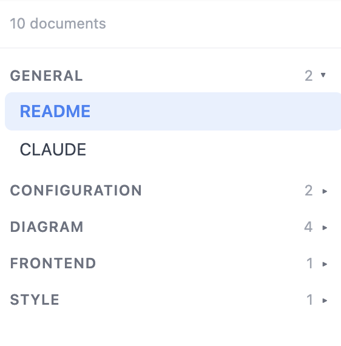
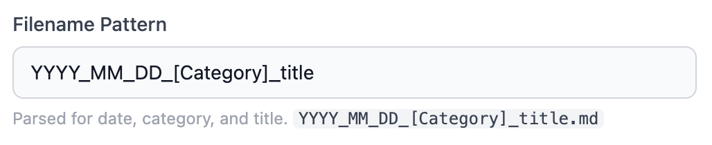
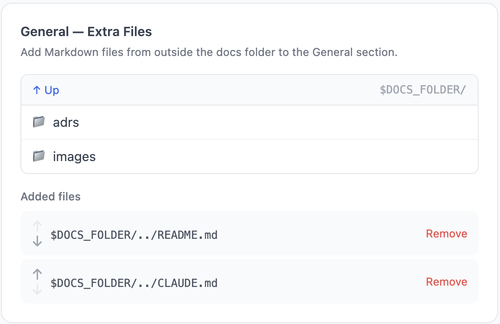
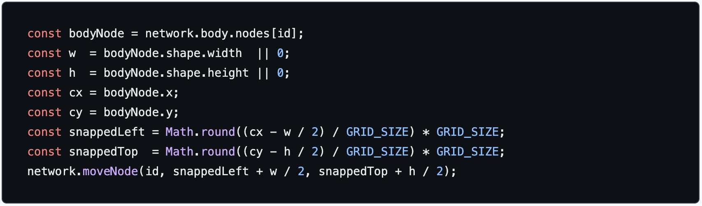
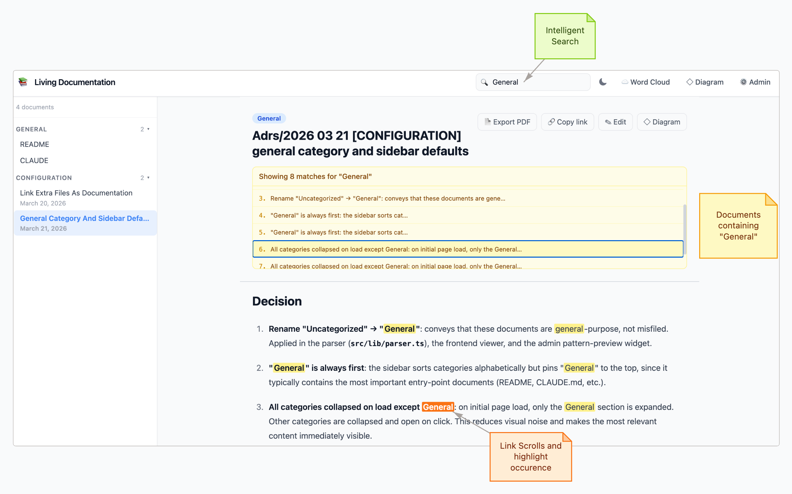

# Living Documentation

A CLI tool that serves a local Markdown documentation viewer in your browser.
`NASHTAZ DOO`
No cloud, no database, no build step — just point it at a folder where you add your project's folder documentation composed of `.md` files (ADR : Architecture Decision Records, generally).


## Features

### Reliability gauge — keep your docs honest

Living Documentation's flagship feature: each document can be **bound to the source files it describes**, so you can see at a glance whether it has drifted from the code.

- **Bind source files** to any doc via the `🗂 Metadata` button in the doc header — pick any file under `sourceRoot` (your project root, configurable in Admin). Each binding stores the file's SHA-256 hash.
- **Reliability gauge** in the sticky doc header — a red → orange → yellow → green gradient bar that fills up as `reliability = unchanged / total`. If every bound file still matches its hash, the bar is full and green; as soon as one file is modified or deleted, the gauge drops and the colour shifts. Hidden when the doc has no bindings. Click it to open the metadata modal.
- **Metadata Files popup** (top bar `📁 Metadata Files`) — central place to list, **replace** or **delete** every file uploaded under `DOCS_FOLDER/files/` (PDFs, specs, mockups attached to docs). After a replace/delete, the popup closes and the search bar is auto-filled with `metadata://<filename>` so you immediately see which documents still reference it.
- **`metadata://<filename>` search prefix** — reverse-lookup documents by the source files they're bound to. Useful to answer "which docs am I supposed to update now that I've changed this PDF/class/module?".
- **MCP tools** (`list_metadata`, `get_accuracy`, `add_metadata`, `refresh_metadata`) — AI agents can detect drift, read the source & the doc, rewrite the doc and re-baseline the hashes autonomously.

### Other features

- **Sidebar** grouped by folder → category, sorted alphabetically; **General** always first
[](/diagram?id=d1775399110713)

- **Categories Sections and General section** — Categories are extracted from the fileName pattern of your Markdown documents (that may be Architecture Decision Records ADRs).
ExtraFiles (added in the admin section) are always first, always expanded in a `GENERAL Section` that holds uncategorized docs and extra files
[](/diagram?id=d1775399110713)

- **Recursive folder scanning** — subdirectories are scanned automatically; each directory level becomes a collapsible folder in the sidebar, nested above the category groups

- **Extra files** — You can add custom ExtraFiles to your documentation that are outside the docs folder (e.g. `README.md`, `CLAUDE.md`) in the `Admin` Page
[](/diagram?id=d1775399110713)

- **Dark mode** — follows system preference, manually toggleable
- **Syntax highlighting** — always dark, high-contrast code blocks
[](/diagram?id=d1775399110713)

- **Full-text search** — instant filter + server-side content search. Returns all the files containing searched occurences, and for each file lists all the occurences, highlight them, and visit them.
[](/diagram?id=d1775399110713)

- **Inline editing** — edit any document directly in the browser, saves to disk instantly
- **Image paste** — paste an image from clipboard in the editor; auto-uploaded and inserted as Markdown
- **File attachments** — drag & drop, paste or pick any non-image file (PDF, archives, office docs…) in the editor; uploaded under `DOCS_FOLDER/files/` and inserted as a paperclip link. Blocked extensions and size limits are configurable from the Admin panel.
- **Snippet inserter** — click **🧩 Snippets** while editing to insert pre-built Markdown constructs at the cursor position:
  - *Simple snippets*: collapsible block (`<details>`), link, link to another document, anchor link, anchor link in another document, numbered list (3 levels), bullet list (3 levels), code block, blockquote, horizontal separator, image
  - *Complex snippets*: **table editor** (dynamic rows/columns grid, generates aligned Markdown table) and **tree editor** (indentation-based ASCII tree, generates a `text` code block with `├──` / `└──` connectors)
  - **Detection mode**: select an existing snippet in the editor before opening the panel — the type is detected automatically and all fields are pre-filled for editing; an informational message is shown when the selection is recognised (green) or unrecognised (orange)
- **Anchor navigation** — links to headings within a document (e.g. `[See section](#my-heading)`) scroll to the correct position after async rendering; heading IDs are generated automatically from their text content
- **Export to PDF** — Export the markdown as a PDF document
- **Diagram editor** — built-in canvas diagram editor; deep-link to any diagram in the C4 Model Style; Paste images into diagrams; Export PNG From Images; And Many more features ...

- **Admin panel** — configure title, theme, filename pattern, and extra files in the browser
- **Word Cloud** — visualise the dominant vocabulary of any folder on disk; supports `.md`, `.ts`, `.java`, `.kt`, `.py`, `.go`, `.rs`, `.cs`, `.swift`, `.rb`, `.html`, `.css`, `.yml`, `.json` and more; stop words filtered per language

---

## Quick start

```bash
npx living-documentation ./path/to/docs
```

Then open [http://localhost:4321](http://localhost:4321).

> **The folder argument must be a relative path** (`./docs`, `../shared/docs`, etc.). Absolute paths (`/abs/...`) and `~`-prefixed paths are rejected at startup so the generated `.living-doc.json` stays portable across machines and can be committed to git.

---

## Installation

### npx (no install)

```bash
npx living-documentation ./docs
```

### Global install

```bash
npm install -g living-documentation
living-documentation ./docs
```

### Local development

```bash
git clone <repo>
cd living-documentation
npm install
npm run dev -- ./docs        # nodemon + ts-node, auto-restarts on changes
```

---

## Usage

```
living-documentation [folder] [options]

Arguments:
  folder                Path to the documentation folder (default: ".")

Options:
  -p, --port <number>   Port to listen on (default: 4321)
  -o, --open            Open browser automatically
  -V, --version         Print version
  -h, --help            Show help
```

**Examples:**

```bash
living-documentation ./docs
living-documentation ./docs --port 4000 --open  # override port
living-documentation .                          # current folder
```

---

## Filename convention

Documents are parsed using this default pattern:

```
YYYY_MM_DD_HH_mm_[Category]_title_words.md
```

| Part              | Example              | Parsed as                      |
| ----------------- | -------------------- | ------------------------------ |
| `2024_01_15`      | `2024_01_15`         | Date → Jan 15, 2024            |
| `09_30`           | `09_30`              | Time → 09:30                   |
| `[DevOps]`        | `[DevOps]`           | Category → DevOps              |
| `deploy_pipeline` | `deploy_pipeline`    | Title → Deploy Pipeline        |

**Full example:**

```
2024_01_15_09_30_[DevOps]_deploy_pipeline.md
2024_03_20_14_45_[Frontend]_react_hooks_guide.md
2023_11_03_11_00_[Backend]_api_versioning_strategy.md
```

Files that don't match the pattern are still shown — they appear under **General** with the filename as the title.

### Subdirectories

The docs folder is scanned **recursively**. Each subdirectory level becomes a collapsible **folder** in the sidebar, nested above the category groups extracted from filenames.

- The `[Category]` tag in the filename is always the category, regardless of which folder the file lives in.
- Files without a `[Category]` tag fall into **General**.
- Subdirectory names become the folder labels in the sidebar (title-cased).
- Deep nesting is supported: `adrs/test/file.md` → folder **Adrs** > subfolder **Test** > category > doc.

```
docs/
├── 2024_01_15_09_30_[DevOps]_deploy.md          → (root) category: DevOps
├── adrs/
│   ├── my-decision.md                           → folder: Adrs / category: General
│   ├── 2024_03_01_10_00_[Architecture]_eventsourcing.md  → folder: Adrs / category: Architecture
│   └── test/
│       └── 2024_05_01_11_15_[Architecture]_saga.md       → folder: Adrs > Test / category: Architecture
└── guides/
    └── 2024_06_01_14_00_[Onboarding]_setup.md   → folder: Guides / category: Onboarding
```

**Sidebar rendering order at each level:** General first → subfolders (alphabetical) → other categories (alphabetical).

#### Controlling folder order with a numeric prefix

Folders are sorted alphabetically, which means you can control their order by prefixing the directory name with a number followed by `_`:

```
docs/
├── 1_TUTORIAL/
├── 2_REFERENCE/
└── 3_ADVANCED/
```

The prefix is **hidden in the UI** — the sidebar shows `TUTORIAL`, `REFERENCE`, `ADVANCED` — but the full name (e.g. `1_TUTORIAL`) is visible in the tooltip on hover. Breadcrumb pills on articles follow the same rule.

**Article header** shows one violet pill per folder segment, then a blue pill for the category.

The pattern is **configurable** in the Admin panel. Token order is respected — `[Category]_YYYY_MM_DD_HH_mm_title` is valid. `[Category]` must appear exactly once.

---

## Config file

A `.living-doc.json` file is created automatically in your docs folder on first run:

```json
{
  "filenamePattern": "YYYY_MM_DD_HH_mm_[Category]_title",
  "title": "Living Documentation",
  "theme": "system",
  "port": 4321,
  "extraFiles": [],
  "sourceRoot": null
}
```

All paths stored in this file are **relative to the docs folder** (POSIX slashes), so you can commit `.living-doc.json` to git and share it across machines. The CLI, the API, and the admin panel all reject absolute paths. If you upgrade from an older version whose config contains absolute paths, they are silently migrated to relative on the first read — a one-time `[living-doc] Migrating …` message is printed to the console.

You can edit this file manually or use the **Admin panel** at [http://localhost:4321/admin](http://localhost:4321/admin).

### Extra files

The `extraFiles` field accepts an ordered list of **paths relative to the docs folder** pointing to `.md` files located **outside** it. These files always appear in the **General** section, before regular General documents, in the order defined.

```json
{
  "extraFiles": [
    "../README.md",
    "../CLAUDE.md"
  ]
}
```

Use the Admin panel's **General — Extra Files** section to browse the filesystem and manage this list without editing the config manually — it stores relative paths automatically.

### Source root

The `sourceRoot` field (relative path, or `null` to default to the docs-folder parent, e.g. `".."`) tells the MCP source tools (`list_source_files`, `read_source_file`, `search_source`) and the metadata picker where your project's source code lives relative to the docs folder. Set it to `"../src"` or similar if your source is nested differently.

---

## Project structure

```
living-documentation/
├── bin/
│   └── cli.ts                  CLI entry point (Commander)
├── src/
│   ├── server.ts                Express app (mounts routes + static frontend)
│   ├── routes/
│   │   ├── documents.ts         Documents API (list, search, read, write, create, delete)
│   │   ├── config.ts            Config API
│   │   ├── browse.ts            Filesystem browser API (+ mkdir)
│   │   ├── images.ts            Image upload API
│   │   ├── files.ts             File attachment upload API (paperclip)
│   │   ├── wordcloud.ts         Word cloud raw text reader
│   │   ├── diagrams.ts          Diagrams CRUD API (vis-network JSON)
│   │   ├── annotations.ts       Per-document highlight markers API
│   │   ├── metadata.ts          Source-file bindings + reliability report
│   │   ├── browse-source.ts     Source tree navigator (rooted at sourceRoot)
│   │   └── export.ts            HTML export (PDF, Notion, Confluence zip)
│   ├── mcp/
│   │   ├── server.ts            Model Context Protocol server (Streamable HTTP)
│   │   └── tools/
│   │       ├── documents.ts     MCP tools: list/read/create document
│   │       ├── diagrams.ts      MCP tools: list/read/create diagram
│   │       ├── source.ts        MCP tools: list/read/search source files
│   │       └── metadata.ts      MCP tools: list_metadata, get_accuracy, add_metadata, refresh_metadata
│   ├── lib/
│   │   ├── parser.ts            Filename parser
│   │   ├── config.ts            Config management (.living-doc.json)
│   │   ├── metadata.ts          .metadata.json store + reliability formula
│   │   └── hash.ts              sha256File helper
│   └── frontend/
│       ├── index.html           Main viewer shell
│       ├── admin.html           Admin panel
│       ├── diagram.html         Diagram editor shell
│       ├── i18n.js              i18n loader (window.t + data-i18n binding)
│       ├── i18n/{en,fr}.json    Translation catalogs
│       ├── wordcloud.js         Word cloud logic
│       ├── vendor/              Vendored browser libraries (wordcloud2.js)
│       ├── *.js                 Viewer modules (state, sidebar, search, documents, …)
│       └── diagram/*.js         Diagram editor modules (network, panels, history, …)
├── scripts/
│   └── copy-assets.ts           Build helper (copies frontend + starting-doc to dist/)
├── starting-doc/                Sample docs shipped with the npm package
├── documentation/adrs/          Architecture Decision Records for this project
├── package.json
└── tsconfig.json
```

---

## API reference

| Method   | Endpoint                       | Description                                                        |
| -------- | ------------------------------ | ------------------------------------------------------------------ |
| `GET`    | `/api/documents`               | List all documents with metadata (includes extra files)            |
| `GET`    | `/api/documents/:id`           | Get document content + rendered HTML                               |
| `POST`   | `/api/documents`               | Create a new document from `{ title, category, folder?, content? }` |
| `PUT`    | `/api/documents/:id`           | Save document content to disk                                      |
| `DELETE` | `/api/documents/:id`           | Delete a document                                                  |
| `GET`    | `/api/documents/search?q=`     | Full-text search                                                   |
| `GET`    | `/api/config`                  | Read config                                                        |
| `PUT`    | `/api/config`                  | Update config (`title`, `theme`, `filenamePattern`, `extraFiles`, `showDiagramDebug`, `sourceRoot`, `blockedFileExtensions`) |
| `GET`    | `/api/browse?path=`            | List directories and `.md` files at a given filesystem path        |
| `GET`    | `/api/browse/alldirs?path=`    | List directories recursively (for the folder picker)               |
| `POST`   | `/api/browse/mkdir`            | Create a new folder under the docs root                            |
| `POST`   | `/api/images/upload`           | Upload a base64 image; saved to `DOCS_FOLDER/images/`              |
| `POST`   | `/api/files/upload`            | Upload a base64 file attachment; saved to `DOCS_FOLDER/files/`     |
| `GET`    | `/api/files`                   | List every file under `DOCS_FOLDER/files/` (chronological)         |
| `PUT`    | `/api/files/:filename`         | Replace an existing attachment with a new base64 payload           |
| `DELETE` | `/api/files/:filename`         | Delete an attachment                                               |
| `GET`    | `/api/metadata/:docId`         | Reliability report for one doc (per-entry status + score)          |
| `POST`   | `/api/metadata/:docId`         | Add or replace a source-file binding for a doc                     |
| `DELETE` | `/api/metadata/:docId`         | Remove a binding                                                   |
| `POST`   | `/api/metadata/:docId/refresh` | Re-hash all bindings (re-baseline after the doc has been updated)  |
| `GET`    | `/api/browse-source?path=`     | Navigate the source tree rooted at `sourceRoot`                    |
| `GET`    | `/api/diagrams`                | List saved diagrams                                                |
| `GET`    | `/api/diagrams/:id`            | Read a single diagram (nodes + edges)                              |
| `PUT`    | `/api/diagrams/:id`            | Create or update a diagram                                         |
| `DELETE` | `/api/diagrams/:id`            | Delete a diagram                                                   |
| `GET`    | `/api/annotations`             | List annotations for all documents                                 |
| `GET`    | `/api/annotations/:docId`      | List annotations for one document                                  |
| `POST`   | `/api/annotations/:docId`      | Add an annotation                                                  |
| `DELETE` | `/api/annotations/:docId/:id`  | Delete one annotation                                              |
| `POST`   | `/api/export/html`             | Export a document (or a zip bundle) as HTML — Notion / Confluence modes |
| `POST`   | `/api/export/markdown`         | Export documents as a Markdown bundle                              |
| `GET`    | `/api/wordcloud?path=&ext=`    | Recursively concatenate matching files as raw text                 |
| `POST`   | `/mcp`                         | Model Context Protocol endpoint (Streamable HTTP)                  |
| `GET`    | `/mcp`                         | Summary of available MCP tools and prompts                         |

---

## MCP server (Model Context Protocol)

Living Documentation exposes an **MCP server** over HTTP so that AI assistants (Claude Desktop, Claude Code, Cursor, etc.) can read and create documents and diagrams programmatically — without leaving your editor.

The server starts automatically alongside the Express app; no extra process is needed.

### Endpoint

```
POST http://localhost:4321/mcp
```

Transport: **Streamable HTTP** (stateless — one session per request).

A `GET http://localhost:4321/mcp` returns a JSON summary of available tools for quick inspection.

### Available tools

| Tool | Description |
|---|---|
| `get_server_guide` | Return the server guide (purpose, workflow, diagram conventions, coordinate system) |
| `list_documents` | List all documents with their id, title, category and folder |
| `read_document` | Read the raw Markdown content of a document by its id |
| `create_document` | Create a new Markdown document (filename generated from the configured pattern) |
| `list_diagrams` | List all saved diagrams with their id and title |
| `read_diagram` | Read the nodes and edges of a diagram (same shape as `create_diagram` input) |
| `create_diagram` | Create or overwrite a diagram from nodes and edges (shapes, colors, labels) |
| `list_source_files` | List project source files under `sourceRoot` (fallback only) |
| `read_source_file` | Read a source file under `sourceRoot` (fallback only) |
| `search_source` | Grep-like text search across files under `sourceRoot` |
| `list_metadata` | List the source-file bindings of every doc |
| `get_accuracy` | Get the reliability report of a doc (per-entry status + ratio) — detect drift |
| `add_metadata` | Bind a source file to a doc (stores the SHA-256 hash) |
| `refresh_metadata` | Re-hash all bindings for a doc — re-baseline after the doc has been rewritten |

Prompts (`generate-context-diagram`, `generate-container-diagram`, `generate-uml-diagram`, `update-diagram-from-docs`, `generate-screen-guide`, `flow`, `erd`) are exposed alongside the tools for clients that surface MCP prompts to the user.

### Installation — Claude Desktop

Add the following to your `claude_desktop_config.json` (macOS: `~/Library/Application Support/Claude/claude_desktop_config.json`):

```json
{
  "mcpServers": {
    "living-documentation": {
      "type": "http",
      "url": "http://localhost:4321/mcp"
    }
  }
}
```

Then restart Claude Desktop. Living Documentation must be running (`npx living-documentation ./docs`) before Claude Desktop connects.

### Installation — Claude Code

Add the MCP server to your project with:

```bash
claude mcp add --transport http living-documentation http://localhost:4321/mcp
```

Or add it manually to `.claude/settings.json` / `~/.claude/settings.json`:

```json
{
  "mcpServers": {
    "living-documentation": {
      "type": "http",
      "url": "http://localhost:4321/mcp"
    }
  }
}
```

---

## Build

```bash
npm run build    # compiles TypeScript → dist/ and copies HTML assets
```

The compiled package is self-contained inside `dist/`. Only `dist/` is included in the npm publish.

---

## Tests

End-to-end tests use **[Playwright](https://playwright.dev)**. Each test spawns a real CLI child process against a fresh copy of a fixture directory on a random free port, so tests run in parallel without leaking state.

### Running tests

```bash
npm run test:e2e          # full suite, headless Chromium (~11 s, ≈ 86 tests)
npm run test:e2e:ui       # interactive UI mode — step through actions, inspect DOM, replay
```

Useful filters:

```bash
npx playwright test tests/api/documents.spec.ts        # a single file
npx playwright test -g "rejects an absolute"           # by test-name regex
npx playwright test --headed --slow-mo=500             # watch the browser
npx playwright test --last-failed                      # rerun only failing tests
npx playwright show-report                             # open the HTML report after a run
```

### Coverage

Server-side code coverage via **[c8](https://github.com/bcoe/c8)** (V8 native). Each spawned Node process writes a coverage JSON that `c8 report` aggregates.

```bash
npm run test:coverage
open coverage/index.html     # macOS — browse line-by-line coverage
```

Current baseline: **~72%** overall, with `src/routes/*` at **83%** and `src/lib/*` at **83%**. Frontend code (`src/frontend/*`) is excluded.

### CI

`.github/workflows/e2e.yml` runs the suite on every PR and push to `main` (Chromium, cached browsers, `playwright-report/` uploaded on failure).

### Writing new tests

Reuse a fixture directory under `tests/fixtures/<name>/` (copied into `os.tmpdir()` at setup):

- `minimal/` — three flat docs, no extras
- `with-metadata/` — docs + source file + `.metadata.json`
- `with-diagrams/` — `.diagrams.json` pre-populated
- `with-annotations/` — `.annotations.json` pre-populated
- `with-subfolders/` — nested folder tree
- `legacy-abs-paths/` — pre-7.25 config for migration tests

Select a fixture per describe block:

```ts
import { test, expect } from '../helpers/ld-fixture';

test.describe('my feature', () => {
  test.use({ fixtureName: 'with-diagrams' });

  test('does the thing', async ({ request, ld }) => {
    const res = await request.get(`${ld.baseURL}/api/diagrams`);
    expect(res.ok()).toBe(true);
  });
});
```

---

## License

AGPL-3.0