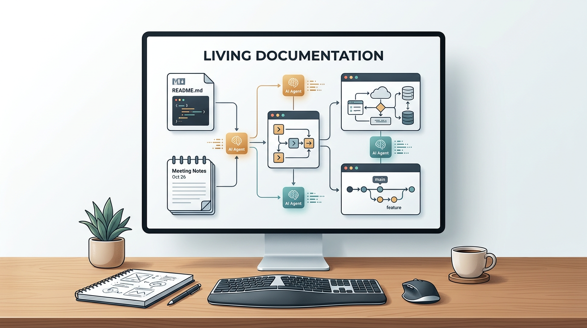
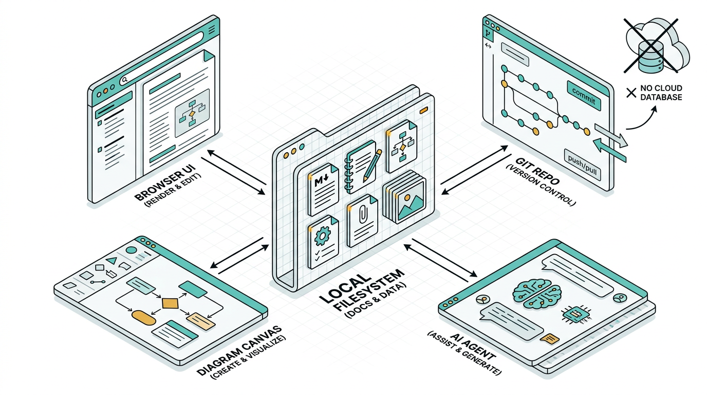
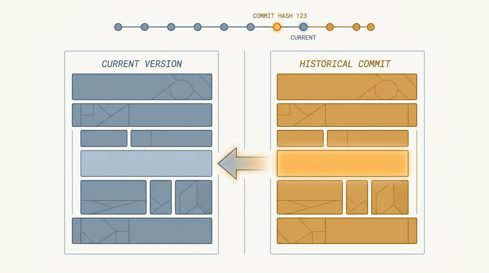
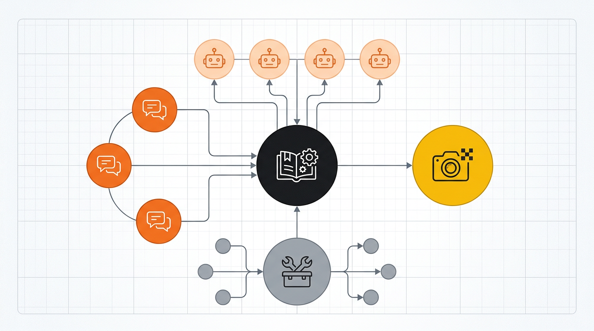
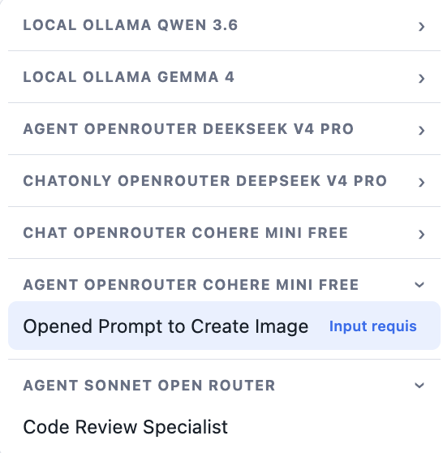
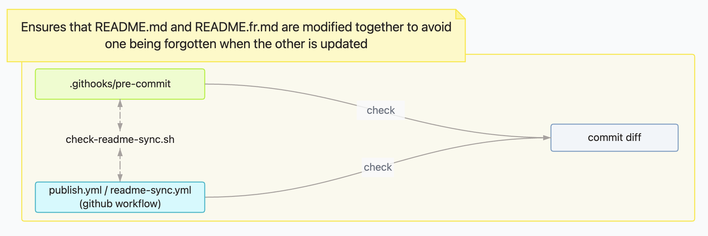
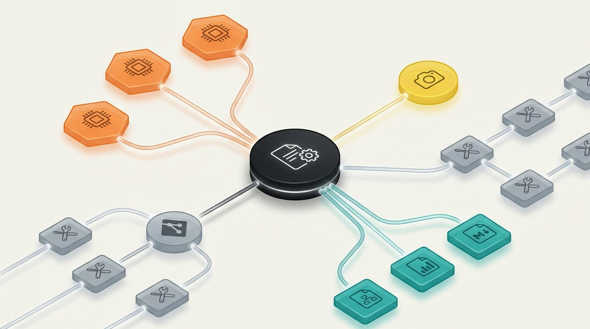

---
**language:** en
---

# Living Documentation

[🇫🇷 Lire en français](./README.fr.md)

> **A local workshop to generate, maintain, version, and automate your documentation.**

**Living Documentation** is not a code generation tool. It is a documentation production tool: local Markdown, notes, processes, ADRs, diagrams, Git, AI agents, LLM providers, generated images, MCP, and automations.

Everything stays in your files. You start the tool, open the browser, and document. Then you can connect Git, your agents, your LLMs, and your workflows.

    

```bash
npx living-ai-documentation@latest
```



---

## Why use it?

Documentation often ends up scattered: README files, notes, tickets, screenshots, ADRs, prompts, exports, diagrams, AI conversations, and attachments. **Living Documentation** brings all of that back into one local space that is readable, versionable, and usable by agents.

| Need | What Living Documentation provides |
| --- | --- |
| Write fast | Markdown editor, snippets, tables, images, attachments, annotations. |
| Structure | Folders, categories, naming conventions, full-text search. |
| Version | Git integration, automatic commits, visual comparison, block-level restore. |
| Visualize | Diagram editor, images, exports, clickable links inside documents. |
| Automate | Workspace, LLM providers, reusable agents, internal MCP tools. |
| Stay in control | Local files, no imposed cloud, no proprietary database. |

---

## Features that change the workflow

### Local-first documentation

Your documents are simple Markdown files in a folder.

- readable in any editor
- versionable with Git
- usable by your LLMs
- portable from one project to another
- easy to back up



### Built-in Git, versions, and restore

When Git integration is enabled, Living Documentation can create a commit after each documentation save. You can then open a document history, compare HEAD with an older commit, and restore precise blocks into the current document.



### Workspace, LLMs, and agents

The <kbd>Workspace</kbd> lets you configure LLM providers and create documentation agents: translation, correction, summary, image generation, Markdown improvement, draft production, document audit.

Agents can work in **Chat only** mode or with Living Documentation **MCP tools** when the provider supports them.



### Agents available from the whole app

Once created, agents are available from the <kbd>Agents</kbd> menu, no matter which page is open. Each execution produces a run document with status, input, response, and optional debug details.



### Diagrams and sketches

Living Documentation includes a built-in diagram editor. You can draw manually, link diagrams to Markdown documents, export them, or let an agent propose a first version from a document.



### Agentic automation lab

With Workspace, MCP, LLM providers, and internal tools, Living Documentation becomes an automation lab applied to documentation. You can create agents that read a document, transform it, generate an image, write meeting notes, or enrich your documentation base.



---

## Quick start

Requires **Node.js 20.19 or newer**.

```bash
# Interactive wizard: creates an EN or FR starter
npx living-ai-documentation@latest

# Or serve an existing folder
npx living-ai-documentation@latest ./docs

# Explicit port
npx living-ai-documentation@latest ./docs --port 4000 --open
```

Then open:

- application: [http://localhost:4321](http://localhost:4321)
- admin: [http://localhost:4321/admin](http://localhost:4321/admin)
- MCP: [http://localhost:4321/mcp](http://localhost:4321/mcp)

The first launch can create a complete documentation starter, in French or English, with built-in guides for Home, Markdown, Workspace, Agents, and Diagram.

> The folder passed to the CLI must be a relative path (`./docs`, `../documentation`). Absolute paths and `~` are rejected to keep `.living-doc.json` portable.

---

## What the app contains

| Surface | Usage |
| --- | --- |
| <kbd>Home</kbd> | Read, create, edit, search, and organize Markdown documents. |
| <kbd>Workspace</kbd> | Configure LLM providers, MCP, agents, and image providers. |
| <kbd>Agents</kbd> | Run agents from any page. |
| <kbd>Diagram</kbd> | Create and edit diagrams linked to documents. |
| <kbd>Files</kbd> | Browse attachments and documentation assets. |
| <kbd>AI Context</kbd> | Inspect AI context, rules, memory, and the MCP explorer. |
| <kbd>Admin</kbd> | Configure theme, language, Git, patterns, file security, agent debug. |

---

## Writing in Living Documentation

The Home viewer is also a Markdown editor.

Useful features:

- inline editing with disk save
- Markdown snippets
- assisted tables
- ASCII trees
- collapsible blocks
- callouts
- images pasted from the clipboard
- attachments
- annotations
- automatic table of contents
- full-text search

Files are organized by real folders and by categories extracted from the file name:

```text
PROCESS/2026_06_30_10_00_[GUIDE]_prepare_a_meeting.md
```

Here:

- `PROCESS` is the folder
- `GUIDE` is the category
- `prepare_a_meeting` is the title

---

## Git and versions

Git integration is optional, but strongly recommended.

It enables:

- automatic commits after saves
- push disabled or push every N commits
- warning when Git is not configured
- detection of changes outside the documentation folder
- <kbd>Versions</kbd> button on documents
- visual diff between HEAD and a selected commit
- block-level restore from an older version

Living Documentation only commits the configured documentation folder. Changes outside this folder are ignored and reported.

---

## Agents and MCP

Living Documentation exposes a local MCP server at:

```text
http://localhost:4321/mcp
```

MCP-compatible agents can use the internal tools to:

- list and read documents
- create or update a document
- manage metadata
- generate diagrams
- generate images through a configured image provider
- read the sourceRoot when necessary
- save an execution context

The `GET /mcp` endpoint returns the live schemas of available tools and prompts. This README intentionally does not duplicate that list: it evolves with the product.

### Claude Code example

```bash
claude mcp add --transport http living-ai-documentation http://localhost:4321/mcp
```

### Claude Desktop example

```json
{
  "mcpServers": {
    "living-ai-documentation": {
      "type": "http",
      "url": "http://localhost:4321/mcp"
    }
  }
}
```

Use the same endpoint for Cursor, Continue, or any MCP client compatible with Streamable HTTP.

---

## Configuration

Configuration is stored in `.living-doc.json`, inside the documentation folder.

Example:

```json
{
  "filenamePattern": "YYYY_MM_DD_HH_mm_[Category]_title",
  "title": "Living Documentation",
  "theme": "system",
  "language": "en",
  "port": 4321,
  "sourceRoot": "..",
  "extraFiles": [],
  "gitIntegration": {
    "mode": "enabled",
    "pushMode": "never",
    "pushEveryCommits": 1,
    "commitMessage": "docs: update living documentation"
  }
}
```

Important points:

- paths are stored relatively when possible
- `sourceRoot` is used by source tools and agents
- `[Category]` is used to classify documents
- Git can remain unconfigured, disabled, or explicitly enabled
- attachment extensions can be blocked in Admin

---

## Exports

Living Documentation can export:

- a document as printable HTML / browser PDF
- an HTML bundle for Notion or Confluence
- a complete Markdown bundle
- diagrams as images or `.drawio` depending on the case

---

## Local development

```bash
git clone https://github.com/craftskillz/living-documentation.git
cd living-documentation
npm install
npm run dev -- ./documentation
```

In development:

- Vite UI: [http://localhost:5174](http://localhost:5174)
- Express backend: [http://localhost:4321](http://localhost:4321)
- Vite proxy: `/api`, `/mcp`, `/images`, `/files`

Useful commands:

```bash
npm run build
npm run test:e2e
npm run test:coverage
npm run setup-hooks
```

To test the package as it will be published:

```bash
npm run build
node dist/bin/cli.js ./documentation

npm pack
npx ./living-ai-documentation-*.tgz ./documentation
```

> In production, there is no Vite server on `:5174`. The CLI serves the UI, API, and MCP from Express, on the configured port.

---

## Contributing

The repository enforces a bilingual README contract: if you modify `README.md`, you must also update `README.fr.md`, and vice versa.

Enable local hooks after cloning:

```bash
npm run setup-hooks
```

The same check runs in CI through `.github/workflows/readme-sync.yml`.

---

## License

[AGPL-3.0](./LICENSE), © Youssef MEDAGHRI-ALAOUI.
