<!-- table-border: bordered -->
<!-- table-color: info -->
| Table   | Age |
| ------- | --- |
| Youssef | 10  |
| Youssef | 42  |
| Youssef | 34  |


<!-- code-width: 1/2 -->
<!-- code-align: center -->
```
// code ici

const a="Hello";
console.log(a);
```

<!-- mermaid-width: 1/2 -->
<!-- mermaid-align: center -->
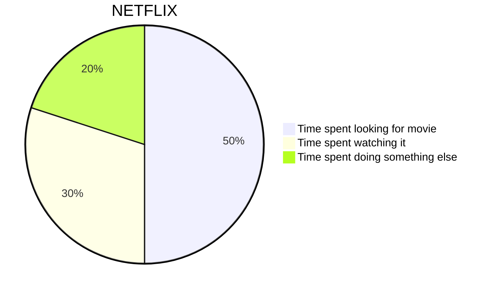

<!-- mermaid-width: 1/2 -->
<!-- mermaid-align: center -->
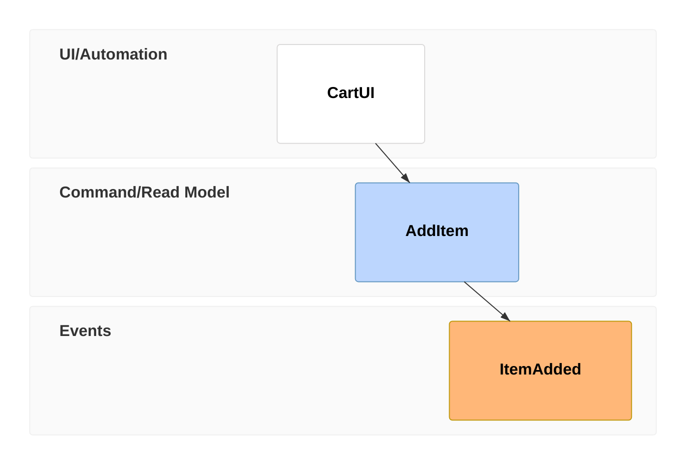

<!-- mermaid-width: 1/2 -->
<!-- mermaid-align: center -->
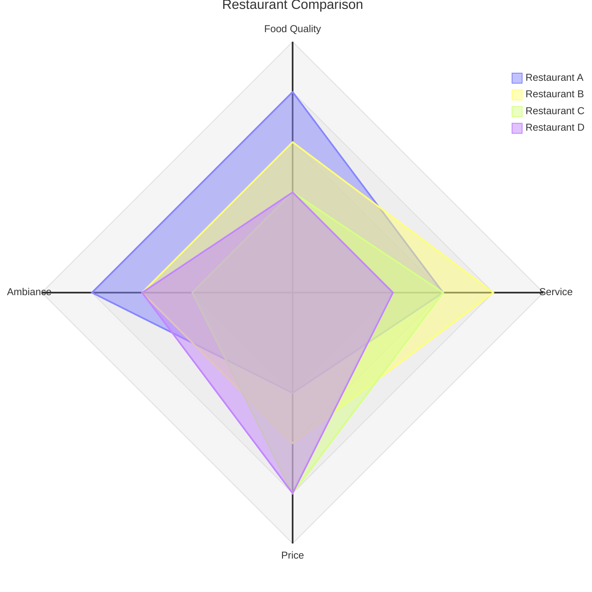

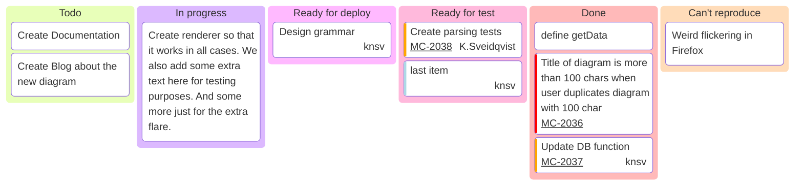

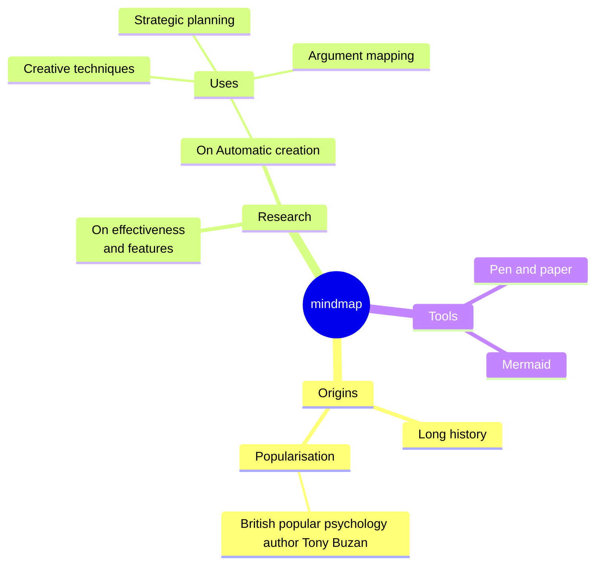

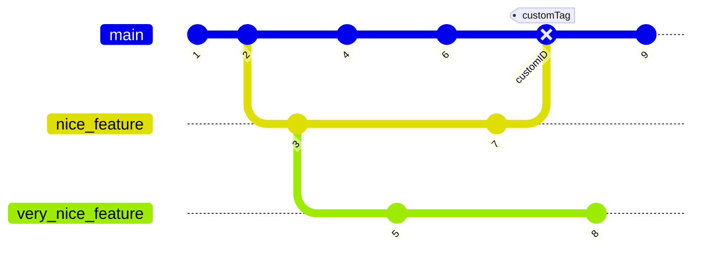


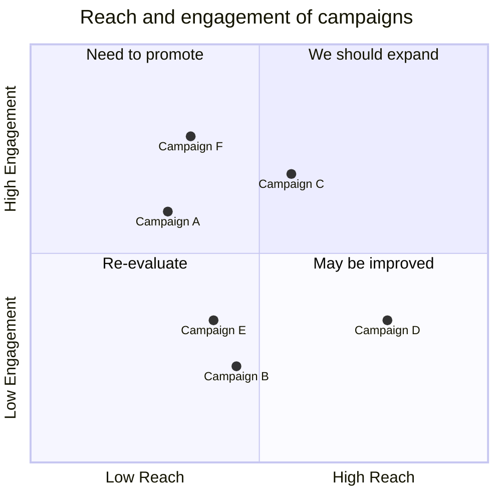

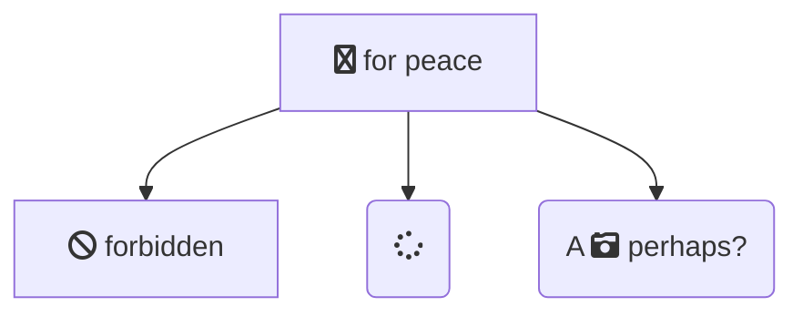
<!-- image-width: 1/2 -->
<!-- image-align: center -->


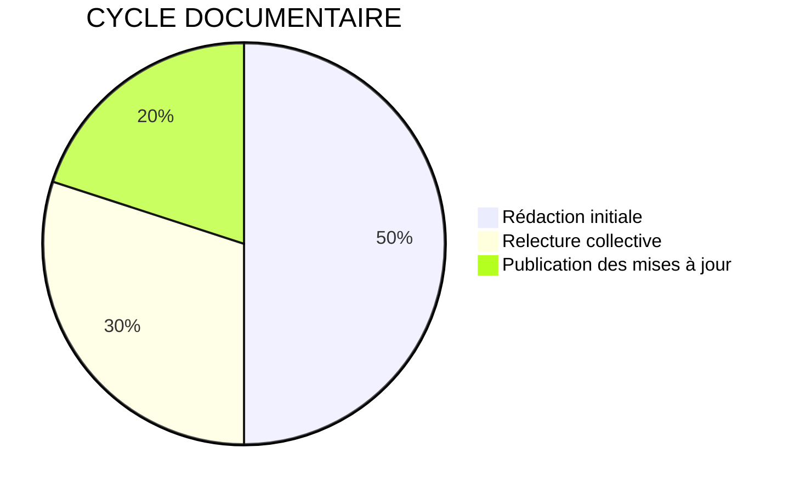

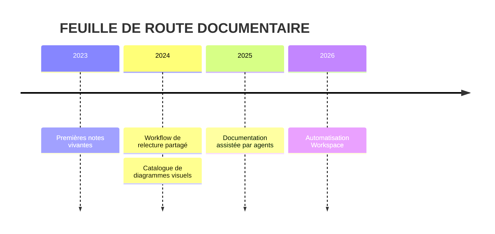

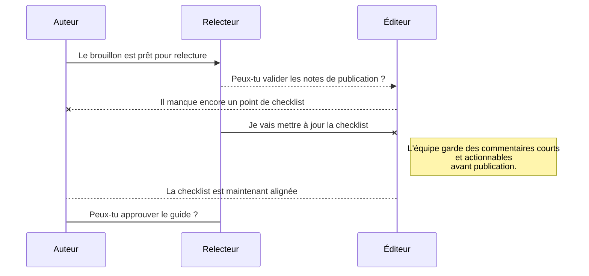

<!-- quote-title: Hello -->
> <!-- table-border: bordered -->
> <!-- table-color: info -->
> | Table   | Age |
> | ------- | --- |
> | Youssef | 10  |
> | Faris   | 42  |
> | Miya    | 34  |

<!-- quote-type: info -->
<!-- quote-title: Info -->
<!-- quote-icon -->
> Citation ici
>
> — Auteur