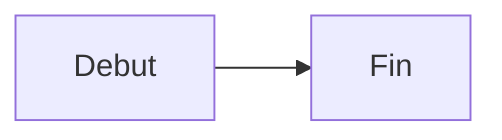

# Ouvrir les images et diagrammes Mermaid en plein ecran

## Gestes dans le viewer

Dans Home, deux gestes ouvrent une image ou un diagramme Mermaid dans le lightbox plein ecran a fond blanc :

- **Shift+Click** sur toutes les plateformes ;
- **Command+Click** sur macOS.

Option+Click et Control+Click ne sont pas utilises par le lightbox afin de rester disponibles pour d'autres interactions.

Exemple Mermaid :

````markdown

````

Une fois le diagramme affiche, effectuer Shift+Click ou Command+Click dessus pour l'agrandir.

Le lightbox se ferme de trois manieres :

- touche `Escape` ;
- clic sur le fond blanc ;
- bouton `×` gris en haut a droite.

## Inserer une image avec l'editeur

Utilisez le snippet **Image** depuis l'editeur. Le panneau permet de choisir la source, le texte alternatif, la largeur relative et l'alignement.

## Inserer une image en Markdown

Image simple :

```markdown

```

Image liee a un document Living Documentation :

```markdown
[](?doc=3_concept%252F2026_04_08_20_58_%255BDOCUMENTING%255D_ADRS)
```

Image liee a un diagramme Living Documentation :

```markdown
[](/diagram?id=d1775684671412)
```

Image liee a une page web :

```markdown
[](https://www.npmjs.com/package/living-ai-documentation)
```

Le geste modifie ouvre l'image elle-meme dans le lightbox sans suivre son lien.
