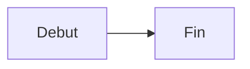

# Styles, images et blocs de code

L'apparence generale des images et des blocs de code est configurable depuis le panneau Admin. Une image, un bloc de code ou un diagramme Mermaid peut aussi surcharger localement sa largeur et son alignement avec des commentaires places juste au-dessus.

## Options globales dans Admin

Dans **Admin → Apparence**, les options disponibles sont :

| Option | Defaut | Effet |
| --- | --- | --- |
| Coins arrondis | active | Arrondit toutes les images du viewer |
| Centrage | active | Centre toutes les images par defaut |
| Bordure | active | Ajoute une bordure et une ombre legeres |
| Theme clair des blocs de code | desactive | Utilise le theme highlight.js clair en mode clair |
| Hauteur max des blocs de code | `400px` | Ajoute un controle afficher plus/moins au-dela de cette hauteur |

Ces options sont stockees dans `.living-doc.json` sous `imageRoundedCorners`, `imageCentered`, `imageBorder`, `codeBlockLightTheme` et `codeBlockMaxHeight`.

## Image Markdown standard

```markdown

```

Sans directive locale, l'image utilise sa largeur naturelle jusqu'a la largeur maximale du document et les options globales actives.

## Choisir la largeur d'une image

Ajouter `image-width` immediatement avant l'image :

```markdown
<!-- image-width: 1/2 -->

```

Valeurs disponibles pour les images, le code et Mermaid :

| Valeur | Largeur |
| --- | ---: |
| `full` | 100 % |
| `3/4` | 75 % |
| `2/3` | 66,67 % |
| `1/2` | 50 % |
| `1/3` | 33,33 % |
| `1/4` | 25 % |

La hauteur reste automatique afin de conserver les proportions de l'image.

## Aligner une image

Ajouter `image-align` avec `left`, `center` ou `right` :

```markdown
<!-- image-align: right -->

```

Cette directive locale prend priorite sur l'option globale de centrage.

## Combiner largeur et alignement d'une image

Les deux directives sont independantes et peuvent etre combinees :

```markdown
<!-- image-width: 1/3 -->
<!-- image-align: center -->

```

L'ordre canonique produit par l'editeur est largeur puis alignement. Les controles correspondants sont aussi disponibles dans **Snippets → Image** et lors de l'edition inline d'une image par clic droit.

## Image cliquable

Une image peut etre enveloppee dans un lien pour ouvrir sa cible :

```markdown
[](./images/schema-architecture.png)
```

## Blocs de code

Les blocs fences utilisent highlight.js et proposent un bouton de copie. Quand leur hauteur depasse `codeBlockMaxHeight`, un controle permet de les developper et de les reduire.

````markdown
```typescript
const message = "Bonjour";
```
````

Le theme clair ne s'applique qu'en mode clair ; le mode sombre conserve le theme de code sombre.

### Largeur et alignement d'un bloc de code

Ajouter `code-width` et/ou `code-align` immediatement avant le fence :

````markdown
<!-- code-width: 1/2 -->
<!-- code-align: right -->
```typescript
const message = "Bonjour";
```
````

Les alignements disponibles sont `left`, `center` et `right`. L'absence d'une directive conserve le comportement par defaut pour la dimension concernee.

Les controles sont disponibles dans **Snippets → Bloc de code** et lors de l'edition inline par clic droit.

## Diagrammes Mermaid

Un fence dont le langage est `mermaid` utilise les directives distinctes `mermaid-width` et `mermaid-align` :

````markdown
<!-- mermaid-width: 2/3 -->
<!-- mermaid-align: center -->

````

Le SVG occupe la largeur choisie tout en conservant son ratio. Le meme panneau de snippet est utilise : quand le langage vaut `mermaid`, les commentaires `mermaid-*` sont produits automatiquement.
